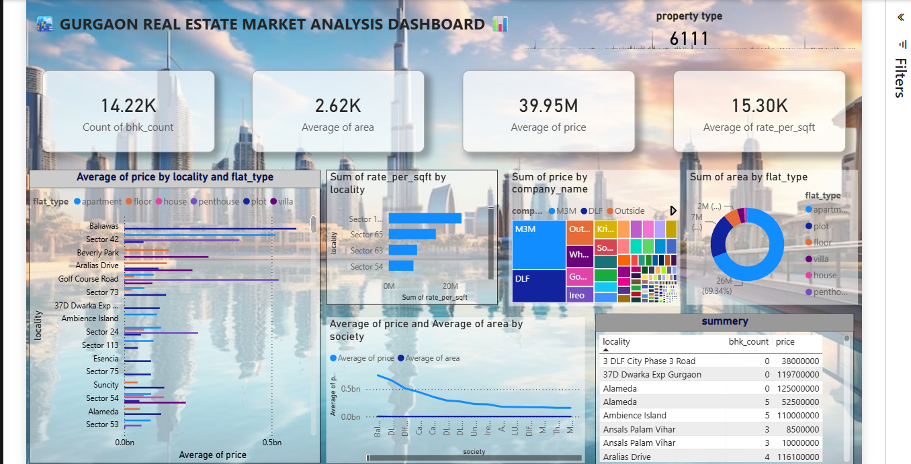

# 🏙️ Gurgaon Real Estate Market Analysis

##  Project Overview

This project analyzes the Gurgaon real estate market using Python, Pandas, NumPy, Matplotlib, Seaborn, Excel, and Power BI. The objective is to uncover property pricing trends, compare localities and builders, analyze property distribution, and generate business insights through an interactive dashboard that supports data-driven decision-making.

---

#  Business Problem

**How can a real estate company leverage property data to identify pricing trends, compare localities, evaluate builder performance, and support better investment and business decisions?**

---

#  Project Objectives

- Analyze residential property prices across Gurgaon.
- Compare property prices by locality and builder.
- Analyze property distribution based on property type.
- Evaluate average property area and rate per square foot.
- Build an interactive Power BI dashboard.
- Generate business insights and recommendations.

---

#  Dataset Information

The dataset contains residential property information from Gurgaon.

### Features

- Price
- Status
- Area
- Rate per Square Foot
- Property Type
- Locality
- Builder Name
- RERA Approval
- BHK Count
- Society

---

#  Tools & Technologies

| Tool | Purpose |
|------|---------|
| Python | Data Cleaning & Analysis |
| Pandas | Data Manipulation |
| NumPy | Numerical Analysis |
| Matplotlib | Data Visualization |
| Seaborn | Statistical Data Visualization |
| Microsoft Excel | Data Preparation |
| Power BI | Interactive Dashboard Development |

---

#  Project Workflow

### 1. Data Collection
- Imported the Gurgaon Real Estate dataset.

### 2. Data Cleaning
- Removed duplicate records.
- Handled missing values.
- Corrected data types.
- Prepared the dataset for analysis.

### 3. Exploratory Data Analysis (EDA)

Performed data analysis using:

- Pandas
- NumPy
- Matplotlib
- Seaborn

### 4. Dashboard Development

Developed an interactive Power BI dashboard featuring:

- KPI Cards
- Locality-wise Price Analysis
- Builder-wise Property Analysis
- Property Type Distribution
- Average Area Analysis
- Average Rate per Square Foot
- Interactive Filters

---

#  Dashboard Preview



---

# 📈 Dashboard Features

### KPI Cards

- Total Properties
- Average Property Price
- Average Area
- Average Rate per Square Foot

### Interactive Filters

- Locality
- Property Type
- Builder Name
- Society
- BHK Count

### Visualizations

- Locality-wise Property Price Analysis
- Builder-wise Property Analysis
- Property Type Distribution
- Average Area Analysis
- Average Rate per Square Foot
- Society-wise Property Comparison

---

#  Business Questions

- Which localities have the highest average property prices?
- Which builders offer the most expensive properties?
- What is the average rate per square foot across different localities?
- Which property types dominate the Gurgaon real estate market?
- How does property price vary with BHK count?
- What is the distribution of RERA-approved properties?

---

#  Key Insights

- Identified premium localities with the highest average property prices.
- Compared builder-wise pricing trends across Gurgaon.
- Analyzed average rate per square foot across different localities.
- Evaluated the distribution of different property types.
- Explored property availability based on BHK count and RERA approval status.

---

#  Business Recommendations

- Focus investments on high-growth localities.
- Compare builder performance before making investment decisions.
- Use rate per square foot as a benchmark for property valuation.
- Develop targeted marketing strategies based on locality demand.
- Utilize market insights to support pricing and investment decisions.

---

#  Repository Structure

```text
Gurgaon-Real-Estate-Market-Analysis
│
├── Dashboard.pbix
├── Dashboard.png
├── cleaned_data.xlsx
├── main.py
├── README.md
└── requirements.txt
```

---

#  Future Improvements

- Build a machine learning model for property price prediction.
- Perform time-series analysis of property prices.
- Integrate live real estate market data.
- Deploy the dashboard using Power BI Service.

